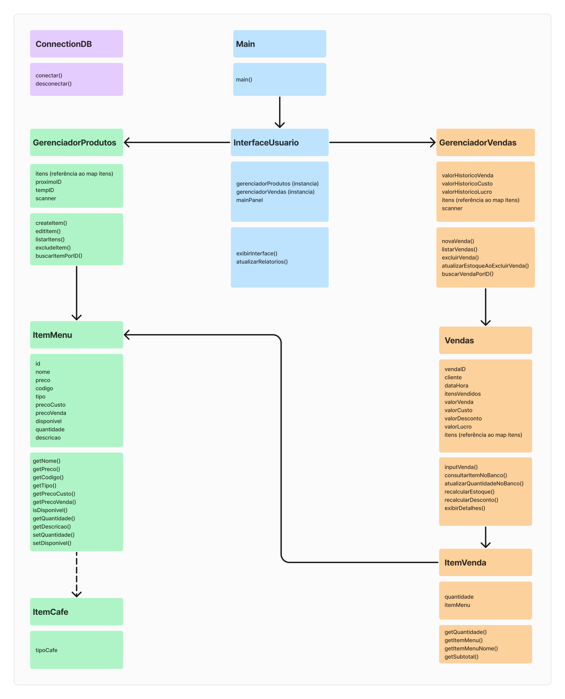

# Projeto: Sistema de Gerenciamento de Cafeteria

**Autores**

- Nome do aluno: Vitor Antonio de Almeida Lacerda. N°USP: 12544761
- Nome do aluno: Bruno Garcia de Oliveira Breda. N°USP: 11212702
- Nome do aluno: Felipe Oliveira Carvalho. N°USP: 14613879

## Descrição do Projeto

Este projeto é um sistema de gerenciamento de uma cafeteria, implementado em Java, utilizando uma interface gráfica (GUI) e integração com um banco de dados MySQL. O sistema permite a adição, edição, listagem e exclusão de produtos e vendas. Ele foi desenvolvido para a disciplina de Programação Orientada a Objetos do curso de Sistemas de Informação da USP.

### Funcionalidades Principais

1. **Gerenciamento de Produtos**
   - Adicionar novo produto
   - Editar produto existente
   - Excluir produto
   - Listar todos os produtos
   - Buscar produto por ID

2. **Gerenciamento de Vendas**
   - Adicionar nova venda
   - Excluir venda existente
   - Listar todas as vendas
   - Buscar venda por ID
   - Relatório de vendas

## Descrição das Classes e Métodos

### Classe `GerenciadorProdutos`
Esta classe gerencia as operações relacionadas aos produtos da cafeteria.

- **Atributos:**
  - `itens`: Mapa de itens (produtos) com IDs como chaves.
  - `proximoID`: Inteiro que representa o próximo ID disponível.
  - `tempID`: ID temporário usado em operações.
  - `scanner`: Scanner para entrada de dados do usuário.

- **Métodos:**
  - `createItem()`: Cria um novo produto e o adiciona ao banco de dados.
  - `editItem()`: Edita um produto existente no banco de dados.
  - `excludeItem()`: Exclui um produto do banco de dados. Não é possível excluir produtos que foram relacionados com alguma venda!
  - `buscarItemPorID()`: Busca um produto pelo ID e exibe suas informações.
  - `listarItens()`: Lista todos os produtos do banco de dados.

### Classe `GerenciadorVendas`
Esta classe gerencia as operações relacionadas às vendas da cafeteria.

- **Atributos:**
  - `valorHistoricoVenda`: Valor total das vendas.
  - `valorHistoricoCusto`: Valor total do custo dos produtos vendidos.
  - `valorHistoricoLucro`: Valor total do lucro das vendas.
  - `itens`: Referência ao mapa de itens (produtos).
  - `scanner`: Scanner para entrada de dados do usuário.

- **Métodos:**
  - `novaVenda()`: Cria uma nova venda e a adiciona ao banco de dados.
  - `excluirVenda()`: Exclui uma venda do banco de dados e ajusta a quantidade de produtos.
  - `listarVendas()`: Lista todas as vendas do banco de dados.
  - `buscarVendaPorID()`: Busca uma venda pelo ID e exibe suas informações.
  - `relatorioVendas()`: Gera um relatório das vendas.

### Classe `InterfaceUsuario`
Esta classe gerencia a interface gráfica do usuário (GUI).

- **Atributos:**
  - `gerenciadorProdutos`: Instância do gerenciador de produtos.
  - `gerenciadorVendas`: Instância do gerenciador de vendas.
  - `mainPanel`: Painel principal da GUI.

- **Métodos:**
  - `InterfaceUsuario()`: Construtor que configura a GUI, menus e ações dos botões.
  - `atualizarRelatorios()`: Atualiza os dados do relatório das vendas.

### Classe `ItemCafe`
Esta classe representa um item de café no menu. Foi criada para uma possível escalabilidade do projeto para outras frentes de atuação do código.

- **Atributos:**
  - tipoCafe

### Classe `ItemMenu`
Classe base para os itens do menu.

- **Atributos:**
  - `id`, `codigo`, `tipo`, `nome`, `precoCusto`, `precoVenda`, `disponivel`, `quantidade`, `descricao`: Informações sobre o item.

- **Métodos:**
  - Construtores, getters e setters.

### Classe `ItemVenda`
Classe que representa um item vendido.

- **Atributos:**
  - `itemMenu`: Referência ao item do menu.
  - `quantidade`: Quantidade do item vendido.

- **Métodos:**
  - Construtor, getters e método `getSubtotal()`.

### Classe `Vendas`
Classe que representa uma venda.

- **Atributos:**
  - `vendaID`, `dataHora`, `cliente`, `itensVendidos`, `valorVenda`, `valorCusto`, `valorLucro`, `valorDesconto`: Informações sobre a venda.
  - `itens`: Referência ao mapa de itens (produtos).

- **Métodos:**
  - Construtor, getters, setters, e métodos `inputVenda()`, `consultarItemNoBanco()`, `atualizarQuantidadeNoBanco()`, `recalcularEstoque()`, `recalcularDesconto()`, `exibirDetalhes()`.

### Classe `ConnectionDB`
Classe que gerencia a conexão com o banco de dados.

- **Atributos:**
  - `URL`, `USER`, `PASSWORD`: Informações para conexão com o banco de dados.

- **Métodos:**
  - `getDatabaseConnection()`: Retorna a conexão com o banco de dados.

### Classe `Main`
Classe principal que inicializa a aplicação.

- **Métodos:**
  - `main()`: Método principal que cria uma instância de `InterfaceUsuario`.

## Diagramas

### Diagrama de Classes


## Procedimentos de Construção

### Instalação do MySQL
1. **Baixar e Instalar o MySQL:**
   - Acesse o site oficial do MySQL: [MySQL Downloads](https://dev.mysql.com/downloads/installer/)
   - Baixe e instale o MySQL Community Server.

2. **Configuração do MySQL:**
   - Durante a instalação, configure a senha do usuário `root`.
   - Após a instalação, abra o MySQL Workbench e conecte-se ao servidor MySQL.

### Configuração do Banco de Dados

1. **Criar o Banco de Dados e Tabelas:**
   ```sql
   -- Criar o banco de dados
   CREATE DATABASE cafeteria_db;

   -- Usar o banco de dados
   USE cafeteria_db;

   -- Criar a tabela de produtos
	CREATE TABLE ItemMenu (
		ID INT NOT NULL AUTO_INCREMENT PRIMARY KEY,
		codigo INT NOT NULL,
		tipo INT NOT NULL,
		nome VARCHAR(255) NOT NULL,
		precoCusto DOUBLE NOT NULL,
		precoVenda DOUBLE NOT NULL,
		disponivel BOOLEAN NOT NULL,
		quantidade INT NOT NULL,
		descricao LONGTEXT NOT NULL
	);

   -- Criar a tabela de vendas
	CREATE TABLE vendas (
		vendaID INT NOT NULL AUTO_INCREMENT PRIMARY KEY,
		dataHora DATETIME NOT NULL,
		cliente VARCHAR(255) NOT NULL,
		valorVenda DOUBLE NOT NULL,
		valorCusto DOUBLE NOT NULL,
		valorLucro DOUBLE NOT NULL,
		valorDesconto DOUBLE NOT NULL
	);

   -- Criar a tabela de itens da venda
	CREATE TABLE itens_venda (
		id INT NOT NULL AUTO_INCREMENT PRIMARY KEY,
		vendaID INT,
		itemID INT,
		quantidade INT,
		subtotal DOUBLE,
		FOREIGN KEY (vendaID) REFERENCES vendas(vendaID),
		FOREIGN KEY (itemID) REFERENCES itemmenu(ID)
	);
   ```

2. **Configuração da Classe `ConnectionDB`:**
   - Verifique se a classe `ConnectionDB` está configurada corretamente para conectar ao MySQL local:
     ```java
     public class ConnectionDB {
         private static final String URL = "jdbc:mysql://localhost:3306/cafeteria_db";
         private static final String USER = "root";
         private static final String PASSWORD = "sua_senha";

         public static Connection getDatabaseConnection() {
             try {
                 return DriverManager.getConnection(URL, USER, PASSWORD);
             } catch (SQLException e) {
                 e.printStackTrace();
                 return null;
             }
         }
     }
     ```

### Procedimentos para Construção e Execução

1. **Configuração do Ambiente de Desenvolvimento:**
   - Instale o Eclipse IDE: [Eclipse Downloads](https://www.eclipse.org/downloads/)
   - Instale o JDK (Java Development Kit): [JDK Downloads](https://www.oracle.com/java/technologies/javase-downloads.html)

2. **Configuração do Projeto no Eclipse:**
   - Importe o projeto para o Eclipse: `File > Import > Existing Projects into Workspace`.
   - Configure o Build Path para incluir o conector JDBC do MySQL: `Right-click on project > Build Path > Configure Build Path > Libraries > Add External JARs`.

3. **Execução do Projeto:**
   - Execute a classe `Main` para iniciar a aplicação.

## Casos de Uso

### Adicionar Produto
1. **Descrição:**
   - O usuário seleciona "Adicionar Produto" no menu.
   - O sistema solicita informações do produto.
   - O usuário insere as informações e confirma.
   - O sistema adiciona o produto ao banco de dados e exibe uma mensagem de sucesso.

2. **Fluxo Alternativo:**
   - Se o usuário cancelar a operação, o sistema não adiciona o produto e exibe uma mensagem de cancelamento.

### Excluir Produto
1. **Descrição:**
   - O usuário seleciona "Excluir Produto" no menu.
   - O sistema solicita o ID do produto a ser excluído.
   - O usuário insere o ID e confirma.
   - O sistema verifica se o produto está relacionado a alguma venda. Se estiver, exibe uma mensagem de erro. Caso contrário, exclui o produto do banco de dados e exibe uma mensagem de sucesso.

### Adicionar Venda
1. **Descrição:**
   - O usuário seleciona "Adicionar Venda" no menu.
   - O sistema solicita informações da venda.
   - O usuário insere as informações dos produtos vendidos e confirma.
   - O sistema calcula o valor total, valor de custo e valor de lucro.
   - O sistema solicita a porcentagem de desconto.
   - O usuário insere a porcentagem de desconto e confirma.
   - O sistema calcula o valor do desconto e ajusta o valor final da venda.
   - O sistema adiciona a venda ao banco de dados e exibe uma mensagem de sucesso com os detalhes da venda.

### Excluir Venda
1. **Descrição:**
   - O usuário seleciona "Excluir Venda" no menu.
   - O sistema solicita o ID da venda a ser excluída.
   - O usuário insere o ID e confirma.
   - O sistema verifica se a venda existe. Se não existir, exibe uma mensagem de erro. Caso contrário, exclui a venda do banco de dados, ajusta as quantidades dos produtos vendidos e exibe uma mensagem de sucesso.

## Possíveis dúvidas

- Não é possível excluir produtos que foram relacionados com alguma venda!
- Os `Tipos` utilizam números inteiros não são definidos no código. O usuário tem uma liberdade para definir os seus próprios tipos de produto conforme a sua necessidade. 
- A quantidade de itens em estoque é modificada conforme vende ou exclui uma determinada venda.

## Comentários Finais
Este projeto foi desenvolvido com o objetivo de fornecer uma solução prática para o gerenciamento de uma cafeteria, utilizando conceitos de Programação Orientada a Objetos e integração com banco de dados. A documentação detalhada visa facilitar a compreensão e manutenção do sistema, além de fornecer um guia completo para a configuração e execução do projeto.
